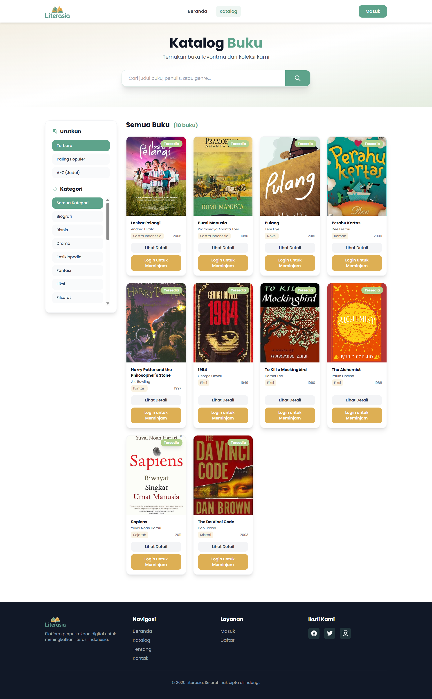
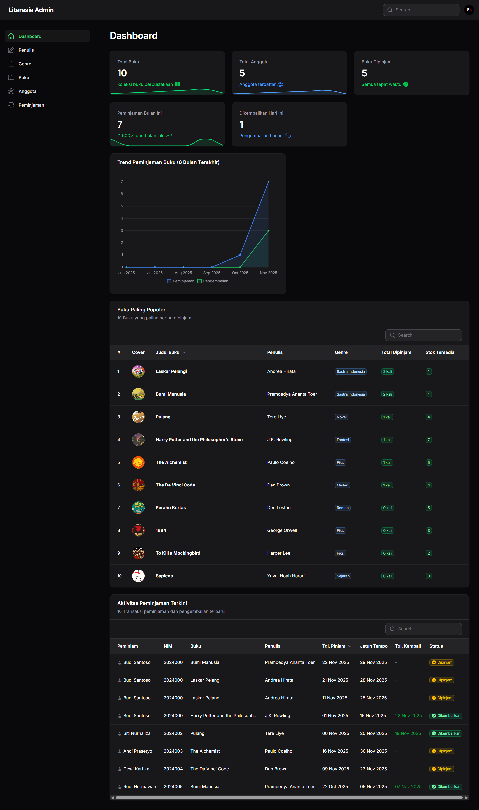

# 📚 Literasia - Sistem Manajemen Perpustakaan Digital

## 🎯 Tentang Literasia

**Literasia** adalah platform perpustakaan digital modern yang dirancang untuk memudahkan pengelolaan dan akses koleksi buku. Sistem ini menggabungkan antarmuka yang user-friendly dengan fitur manajemen yang powerful, memungkinkan perpustakaan untuk beroperasi lebih efisien dan memberikan pengalaman terbaik bagi anggota.

### ✨ Fitur Utama

#### 👥 Untuk Anggota
- **Pencarian Buku Cerdas** - Cari buku berdasarkan judul, penulis, atau genre
- **Katalog Digital Lengkap** - Jelajahi koleksi buku dengan filter dan sorting
- **Sistem Peminjaman Online** - Pinjam buku dengan mudah melalui platform
- **Riwayat Peminjaman** - Lihat histori peminjaman dan status pengembalian
- **Profil Anggota** - Kelola informasi pribadi dan preferensi bacaan

#### 🔧 Untuk Administrator
- **Dashboard Analytics** - Statistik perpustakaan real-time dan visualisasi data
- **Manajemen Buku** - CRUD lengkap untuk koleksi buku dengan upload cover
- **Manajemen Anggota** - Kelola data anggota dan status keanggotaan
- **Sistem Peminjaman** - Proses peminjaman dan pengembalian dengan tracking status
- **Laporan & Statistik** - Widget untuk monitoring:
  - Total koleksi buku dan statistik stok
  - Jumlah anggota aktif dengan trend pertumbuhan
  - Peminjaman aktif dan status keterlambatan
  - Grafik trend peminjaman 6 bulan terakhir
  - Daftar buku terpopuler
  - Aktivitas peminjaman terbaru
- **Manajemen Penulis & Genre** - Organisasi koleksi yang terstruktur

## 🖼️ Tampilan Aplikasi

### 🏠 Halaman Utama (Homepage)
Halaman landing dengan hero section yang menarik, pencarian buku, statistik perpustakaan, koleksi buku terbaru dan populer.

**Fitur:**
- Hero section dengan background perpustakaan dan overlay
- Search bar untuk pencarian cepat
- Quick stats (Total Buku, Kategori, Anggota, Akses 24/7)
- Grid buku terbaru dan terpopuler
- Kategori/genre navigation

---

### 📚 Halaman Katalog
Halaman katalog lengkap dengan filter berdasarkan kategori dan sorting.

**Fitur:**
- Filter berdasarkan kategori/genre
- Sorting (Terbaru, Paling Populer, A-Z)
- Grid view dengan cover buku
- Status ketersediaan buku

---

### 📖 Detail Buku
Halaman detail buku dengan informasi lengkap dan tombol peminjaman.

**Fitur:**
- Cover buku berukuran besar
- Informasi lengkap (Penulis, Genre, Tahun, ISBN)
- Status stok tersedia
- Total peminjaman
- Tombol "Pinjam Buku Sekarang"
- Rekomendasi buku terkait

---

### 🔐 Halaman Login
Form login yang clean dan modern dengan branding Literasia.

**Fitur:**
- Form email dan password
- Remember me checkbox
- Lupa password link
- Link ke halaman registrasi

---

### 📝 Halaman Registrasi
Form pendaftaran anggota baru dengan validasi lengkap.

**Fitur:**
- Form lengkap (Nama, Email, NIM, Telepon)
- Password dengan konfirmasi
- Validasi real-time
- Link ke halaman login

---

### 📋 Halaman Peminjaman Buku
Detail konfirmasi peminjaman dengan informasi lengkap peminjam dan buku.

**Fitur:**
- Informasi buku yang dipinjam
- Informasi peminjam (Nama, Email, NIM, Telepon)
- Detail tanggal pinjam dan jatuh tempo
- Perhatian penting peminjaman
- Tombol konfirmasi peminjaman

---

### 👤 Profil Saya
Dashboard member dengan informasi akun dan statistik peminjaman.

**Fitur:**
- Informasi akun lengkap
- Edit profil dan ganti password
- Informasi anggota (NIM, Nomor HP, Status)
- Ringkasan peminjaman (Sedang Dipinjam, Dikembalikan, Terlambat, Total)
- Tombol logout

---

### 📚 Peminjaman Saya
Riwayat dan status peminjaman aktif member.

**Fitur:**
- Quick stats peminjaman
- Tab "Sedang Dipinjam" dengan detail:
  - Tanggal pinjam dan jatuh tempo
  - Status badge (Dipinjam/Overdue)
  - Link detail
- Tab "Riwayat Peminjaman" untuk buku yang sudah dikembalikan

---

### 🎛️ Dashboard Admin
Dashboard lengkap dengan analytics dan monitoring perpustakaan.

**Widget Dashboard:**
- **Stats Overview** - 5 kartu statistik:
  - Total Buku dengan mini chart koleksi
  - Total Anggota dengan trend pertumbuhan
  - Peminjaman Aktif dengan indikator overdue
  - Peminjaman Bulan Ini dengan persentase perubahan
  - Dikembalikan Hari Ini
- **Borrowing Chart** - Grafik garis 6 bulan terakhir (Peminjaman vs Pengembalian)
- **Popular Books** - Tabel 10 buku terpopuler dengan:
  - Cover buku
  - Judul dan penulis
  - Genre
  - Total peminjaman
  - Stok tersedia
- **Latest Borrows** - Aktivitas peminjaman terbaru

---

### 📚 Manajemen Buku (Admin)
CRUD lengkap untuk manajemen koleksi buku.

**Fitur:**
- Table view dengan cover preview
- Kolom: Cover, Judul, Penulis, Genre, Tahun, Total Stok, Tersedia
- Action buttons: View, Edit, Delete
- Tombol "New Buku" untuk tambah buku baru
- Search dan filter
- Pagination

---

### 📋 Manajemen Peminjaman (Admin)
Monitor dan kelola semua transaksi peminjaman.

**Fitur:**
- Table view dengan kolom:
  - Nama Peminjam
  - Judul Buku
  - Tanggal Pinjam
  - Tanggal Jatuh Tempo
  - Tanggal Kembali
  - Status (Badge berwarna)
- Action button "Kembalikan" untuk buku yang masih dipinjam
- Filter berdasarkan status
- Search peminjam/buku
- Pagination

---

## 🛠️ Teknologi yang Digunakan

### Backend
- **Laravel 12** - PHP Framework modern dan powerful
- **MySQL** - Database relational untuk penyimpanan data
- **Filament 4.0** - Admin panel dengan komponen UI yang kaya
- **Eloquent ORM** - Object-Relational Mapping untuk database

### Frontend
- **Blade Templates** - Template engine Laravel
- **Tailwind CSS** - Utility-first CSS framework
- **Alpine.js** - Lightweight JavaScript framework
- **Chart.js** - Library visualisasi data untuk grafik
- **Heroicons** - Beautiful hand-crafted SVG icons

### Features & Tools
- **Storage System** - Laravel Storage untuk manajemen file upload
- **Authentication** - Sistem autentikasi dengan middleware
- **Validation** - Form validation untuk data integrity
- **Pagination** - Efficient data pagination
- **Seeding & Migration** - Database version control

---

Dibuat dengan ❤️ untuk meningkatkan literasi Indonesia

